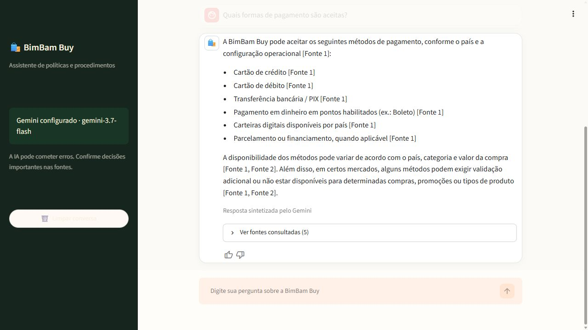
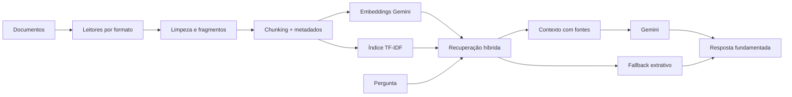

# BimBam Buy AI Agent

Assistente corporativo de conhecimento que ajuda as equipes de Atendimento e
Operações da BimBam Buy a consultar políticas internas em linguagem natural. A
aplicação usa RAG (*Retrieval-Augmented Generation*) para localizar evidências nos
documentos e responder com fontes rastreáveis.

[](https://github.com/eversonIA/bimbam-buy-ai-agent/actions/workflows/tests.yml)
[](https://www.python.org/)
[](https://streamlit.io/)
[](LICENSE)

> **Aplicação pública:** [bimbam-buy-ai-agent.streamlit.app](https://bimbam-buy-ai-agent.streamlit.app)

[](https://bimbam-buy-ai-agent.streamlit.app)

## O problema

Políticas de pagamento, envio, garantia, devolução e afiliados ficam distribuídas em
documentos longos. Encontrar a regra correta durante um atendimento exige tempo e
pode levar a respostas inconsistentes. Este agente centraliza a consulta sem fingir
ter acesso a pedidos, pagamentos ou clientes reais.

## Funcionalidades

- chat em português com histórico durante a sessão;
- respostas baseadas somente nos documentos recuperados;
- fontes exibidas com documento, seção e página quando disponíveis;
- recuperação híbrida: embeddings semânticos e busca lexical TF-IDF;
- fallback local quando a chave ou a API do Gemini não estiver disponível;
- proteção contra instruções maliciosas encontradas nos documentos;
- leitores modulares para PDF, DOCX, XLSX, PPTX, Markdown, CSV, JSON e HTML;
- cache do pipeline no Streamlit;
- testes unitários e conjunto de perguntas de avaliação;
- configuração segura por variáveis de ambiente ou segredos do Streamlit.

## Arquitetura



O índice vetorial é mantido em memória porque a base é pequena. Isso elimina banco,
credenciais e infraestrutura adicionais sem mudar o princípio técnico do RAG.

## Tecnologias e ferramentas

| Componente | Uso no projeto |
| --- | --- |
| Python 3.11+ | pipeline de ingestão, recuperação e geração |
| Streamlit | interface de chat e hospedagem do MVP |
| Gemini 3.7 Flash | síntese fundamentada das respostas |
| Gemini Embedding | representação semântica de documentos e perguntas |
| scikit-learn | índice lexical TF-IDF com palavras e caracteres |
| pypdf, python-docx, openpyxl e python-pptx | leitores modulares de documentos |
| Pytest, Ruff e GitHub Actions | testes, qualidade de código e integração contínua |

## Base de conhecimento

| Documento | Categoria |
| --- | --- |
| FAQ de Métodos de Pagamento | Pagamentos |
| Guia de Envios | Logística |
| Manual de Garantia | Garantia |
| Política de Reembolsos e Devoluções | Pós-venda |
| Programa de Afiliados | Afiliados |

A base utiliza documentos fictícios do Challenge Alura Agentes. O manifesto em
`data/manifest.json` acrescenta categoria, público e versão declarada a cada
documento.

## Como executar

### 1. Preparar o ambiente

```powershell
git clone https://github.com/eversonIA/bimbam-buy-ai-agent.git
cd bimbam-buy-ai-agent
python -m venv .venv
.\.venv\Scripts\Activate.ps1
python -m pip install --upgrade pip
pip install -r requirements.txt
```

### 2. Configurar o Gemini

Copie `.env.example` para `.env` e preencha a chave:

```powershell
Copy-Item .env.example .env
```

```dotenv
GEMINI_API_KEY=sua_chave_aqui
```

O `.env` está ignorado pelo Git. A aplicação também inicia sem chave em modo
extrativo, útil para validar a ingestão e a recuperação localmente.

### 3. Iniciar a aplicação

```powershell
streamlit run streamlit_app.py
```

Abra `http://localhost:8501` no navegador.

## Perguntas de exemplo

- Quanto tempo um pagamento por boleto pode levar para ser confirmado?
- Recebi um produto danificado no transporte. Qual é o prazo para comunicar?
- Depois da aprovação, em quanto tempo normalmente recebo o reembolso?
- Dano causado por líquido é coberto pela garantia?
- Uma venda cancelada continua gerando comissão para o afiliado?
- Qual é o telefone oficial da central de ajuda?

Para a última pergunta, a resposta correta é admitir que o contato não consta na base,
e não inventar um telefone.

### Exemplos validados de respostas

> **Quais formas de pagamento são aceitas?**
>
> Conforme o país e a configuração operacional, a BimBam Buy pode aceitar cartão de
> crédito, cartão de débito, transferência/PIX, boleto, carteiras digitais e
> parcelamento ou financiamento. *(FAQ de Métodos de Pagamento, p. 2)*

> **Recebi um produto danificado no transporte. Qual é o prazo para comunicar?**
>
> O caso deve ser registrado em até 48 horas após o recebimento, com as evidências
> aplicáveis. *(Guia de Envios, p. 7)*

> **Qual é o prazo geral para desistir da compra depois do recebimento?**
>
> A solicitação por arrependimento pode ser feita nos 10 dias corridos subsequentes ao
> recebimento, desde que o produto cumpra os requisitos de elegibilidade. *(Política de
> Reembolsos e Devoluções, p. 3)*

> **Qual é o telefone oficial da central de ajuda?**
>
> Não encontrei essa informação nos documentos disponíveis. Tente reformular a
> pergunta ou consulte a equipe responsável.

## Testes

```powershell
pip install -r requirements-dev.txt
ruff check .
pytest --cov=bimbam_agent --cov-report=term-missing
python scripts/evaluate.py
```

Os casos em `evals/questions.json` incluem perguntas objetivas, ambiguidades e itens
fora do escopo. A avaliação exige tanto a fonte correta quanto os termos essenciais da
resposta. O workflow do GitHub Actions executa lint e testes em cada *push* e *pull
request*.

Última validação local: **48 testes aprovados**, **87% de cobertura** e **11/11 casos
documentais aprovados** no modo offline reproduzível.

## Deploy no Streamlit Community Cloud

1. Publique este repositório no GitHub.
2. Acesse o Streamlit Community Cloud e selecione **Create app**.
3. Escolha o repositório, a branch `main` e `streamlit_app.py`.
4. Em **Advanced settings > Secrets**, cadastre:

   ```toml
   GEMINI_API_KEY = "sua_chave_aqui"
   GEMINI_MODEL = "gemini-3.7-flash"
   GEMINI_EMBEDDING_MODEL = "gemini-embedding-001"
   ```

5. Faça o deploy e valide as perguntas de exemplo.

Nunca faça commit de `.env` ou `.streamlit/secrets.toml`. Consulte [SECURITY.md](SECURITY.md).

## Estrutura

```text
.
├── .github/workflows/      # integração contínua
├── .streamlit/             # tema e exemplo de segredos
├── data/
│   ├── documents/          # base documental
│   └── manifest.json       # metadados da base
├── docs/
│   ├── challenge/          # referências do challenge
│   ├── BACKLOG.md          # acompanhamento da entrega
│   └── DECISIONS.md        # decisões e justificativas
├── evals/                  # perguntas de avaliação
├── src/bimbam_agent/       # ingestão, recuperação e geração
├── tests/                  # testes automatizados
└── streamlit_app.py        # interface web
```

## Limitações conhecidas

- não consulta status real de pedidos, transações ou entregas;
- não substitui análise jurídica nem regras locais que não estejam documentadas;
- os documentos não informam telefone, e-mail ou URL oficial de suporte;
- OCR de documentos escaneados não faz parte deste MVP;
- a qualidade generativa e os limites de uso dependem da API configurada.

## Decisão de deploy

O challenge sugere a OCI ou outro serviço de nuvem que disponibilize uma URL pública.
Neste projeto, foi escolhido o Streamlit Community Cloud pela integração direta com a
aplicação. A decisão está registrada em [docs/DECISIONS.md](docs/DECISIONS.md).

## Checklist de entrega

- [x] base documental organizada;
- [x] arquitetura e tecnologias documentadas;
- [x] agente validado localmente;
- [x] testes e avaliação aprovados;
- [x] repositório público com histórico de commits;
- [x] URL pública funcionando;
- [x] captura de tela do deploy no README;
- [x] exemplos reais de perguntas e respostas revisados.

## Autor

Desenvolvido por [Everson](https://github.com/eversonIA) para o Challenge Alura
Agentes.

## Licença

Distribuído sob a licença [MIT](LICENSE).
